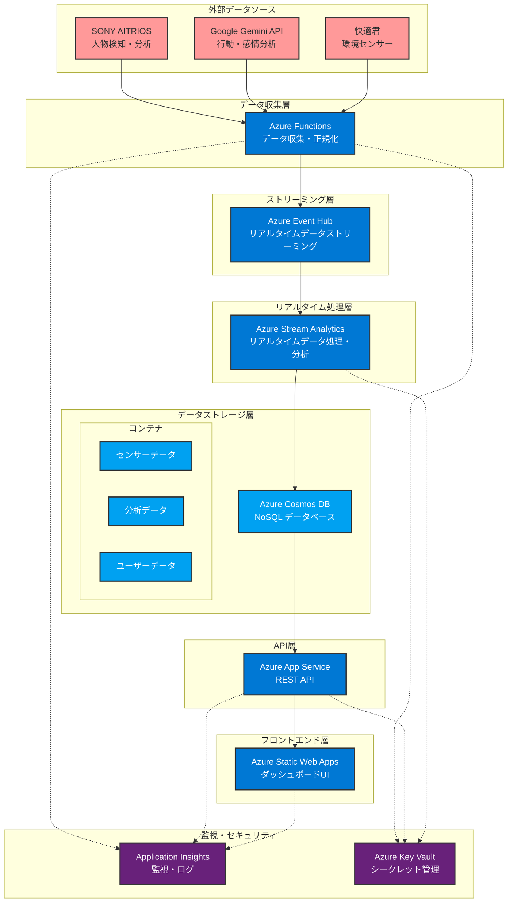
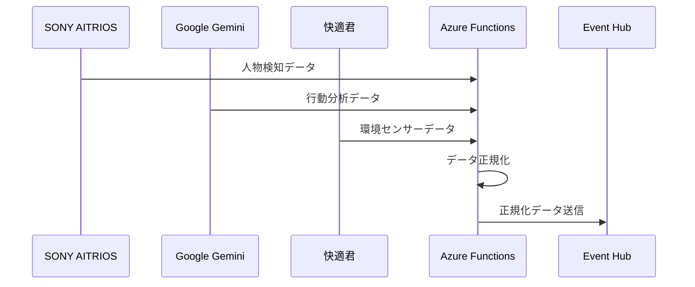
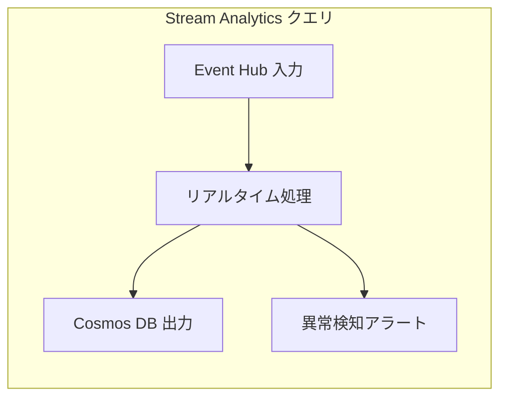
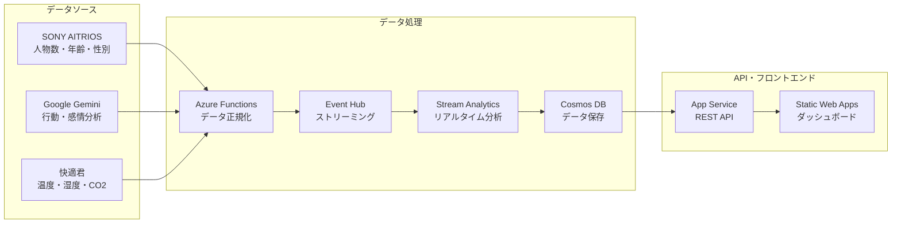

# Microsoft AI Labo スマート空間最適化システム アーキテクチャ

## システム概要

SONY AITRIOS、Google Gemini API、快適君からリアルタイムデータを収集し、Azureクラウド上で処理・分析して、ダッシュボードで可視化するスマート空間最適化システムです。

## アーキテクチャ図



## 詳細アーキテクチャ

### 1. データ収集層



### 2. リアルタイム処理層



### 3. データフロー詳細



## 技術スタック

### フロントエンド
- **Azure Static Web Apps**: ダッシュボードUI
- **HTML/CSS/JavaScript**: フロントエンド実装
- **Chart.js**: グラフ・チャート表示

### バックエンド
- **Azure Functions**: サーバーレスデータ収集
- **Azure App Service**: REST APIサーバー
- **Python/Flask**: API実装

### データ処理
- **Azure Event Hub**: リアルタイムデータストリーミング
- **Azure Stream Analytics**: リアルタイムデータ処理
- **Azure Cosmos DB**: NoSQLデータベース

### 監視・セキュリティ
- **Azure Application Insights**: 監視・ログ
- **Azure Key Vault**: シークレット管理
- **Azure Active Directory**: 認証・認可

## データモデル

### センサーデータ（Cosmos DB - sensor-data）

```json
{
  "id": "uuid",
  "source": "aitrios|gemini|kaiteki",
  "timestamp": "2024-01-01T12:00:00Z",
  "deviceId": "device-001",
  "deviceType": "aitrios",
  "data": {
    "personCount": 5,
    "ageDistribution": [35, 40, 20, 5],
    "genderDistribution": [55, 40, 5],
    "confidence": 0.95
  },
  "type": "sensor_data"
}
```

### 分析データ（Cosmos DB - analysis-data）

```json
{
  "id": "window-timestamp",
  "deviceType": "aitrios",
  "messageCount": 100,
  "avgConfidence": 0.92,
  "totalPersonCount": 25,
  "avgTemperature": 22.5,
  "avgHumidity": 55,
  "avgCO2": 450,
  "anomalyStatus": "Normal"
}
```

## セキュリティ設計

### 認証・認可
- **Azure AD**: ユーザー認証
- **API Keys**: 外部API連携
- **CORS**: クロスオリジン制御

### データ保護
- **Azure Key Vault**: シークレット管理
- **暗号化**: 保存時・転送時
- **ネットワークセキュリティ**: VNet統合

## スケーラビリティ

### 水平スケーリング
- **Event Hub**: パーティション分割
- **Cosmos DB**: 自動スケーリング
- **Functions**: サーバーレス自動スケール

### パフォーマンス
- **CDN**: グローバル配信
- **キャッシュ**: Redis Cache
- **負荷分散**: Application Gateway

## 監視・運用

### 監視項目
- **アプリケーション**: レスポンス時間、エラー率
- **インフラ**: CPU、メモリ、ディスク使用率
- **データ**: 処理量、遅延時間

### アラート
- **異常検知**: 環境値の異常
- **パフォーマンス**: レスポンス時間の悪化
- **可用性**: サービスの停止

## 料金見積もり

### 開発・テスト環境（Free プラン）
- **Static Web Apps**: ¥0
- **Event Hub**: ¥0 (100万メッセージ/月)
- **Cosmos DB**: ¥0 (1000 RU/秒)
- **Functions**: ¥0 (100万実行/月)
- **Stream Analytics**: ¥0 (1時間/月)

### 本格運用環境
- **Event Hub**: ¥1,000-5,000/月
- **Cosmos DB**: ¥5,000-20,000/月
- **Functions**: ¥1,000-3,000/月
- **Stream Analytics**: ¥10,000-30,000/月
- **App Service**: ¥1,000-5,000/月

## 今後の拡張性

### 機能拡張
- **機械学習**: Azure Machine Learning統合
- **予測分析**: 来場者数予測
- **最適化**: 空調・照明制御

### 統合拡張
- **IoT Hub**: デバイス管理
- **Power BI**: 高度な分析・レポート
- **Logic Apps**: ワークフロー自動化
