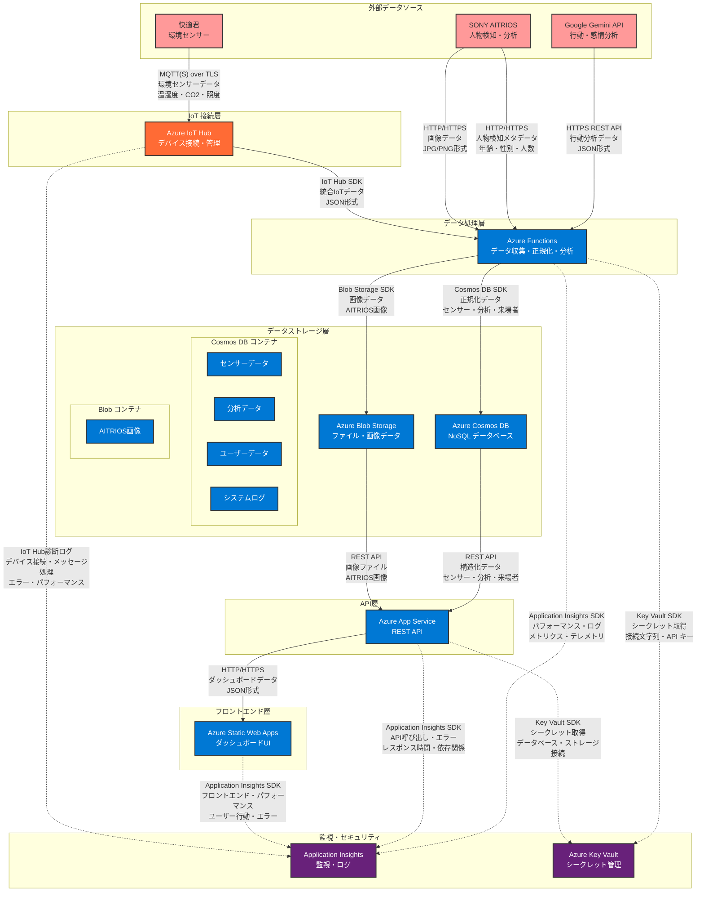

# Microsoft AI Labo スマート空間最適化システム アーキテクチャ

## システム概要

SONY AITRIOS、Google Gemini API、快適君からリアルタイムデータを収集し、Azureクラウド上で処理・分析して、ダッシュボードで可視化するスマート空間最適化システムです。

## 最新アーキテクチャ図



## 各リソースの詳細機能

### 1. 外部データソース

#### **SONY AITRIOS（人物検知・分析）**
- **機能**: エントランスでの人物検知・属性分析
- **出力データ**: 年齢、性別、人数、信頼度
- **通信方式**: HTTP/HTTPS（REST API）
- **処理頻度**: 人物検知時（リアルタイム）
- **データサイズ**: 数KB（メタデータ）

#### **Google Gemini API（行動・感情分析）**
- **機能**: 人物の行動パターン・感情状態の分析
- **出力データ**: 行動分析結果、感情スコア、特徴量
- **通信方式**: HTTPS REST API
- **処理頻度**: 画像・動画分析時
- **データサイズ**: 数KB（分析結果）

#### **快適君（環境センサー）**
- **機能**: 温湿度、CO2濃度、照明状態の監視
- **出力データ**: 温度、湿度、CO2、照度、占有率
- **通信方式**: MQTT(S) over TLS
- **処理頻度**: 数分間隔（定期）
- **データサイズ**: 数KB（センサーデータ）

### 2. Azure IoT Hub

#### **デバイス接続・管理**
- **機能**: IoTデバイスの認証・接続管理
- **対応プロトコル**: MQTT、HTTPS、AMQP
- **セキュリティ**: TLS 1.2、デバイス証明書認証
- **スケーラビリティ**: 数百万デバイス接続対応
- **料金**: 8000メッセージ/日まで無料

### 3. Azure Functions

#### **データ収集・正規化・分析**
- **機能**: サーバーレスデータ処理
- **処理内容**:
  - データ形式の統一（JSON正規化）
  - データ検証・異常値検出
  - 時系列データの集計・分析
  - 画像データの前処理
- **実行環境**: Python 3.11
- **スケーリング**: 自動スケール（従量課金）
- **料金**: 100万実行/月まで無料

### 4. Azure Cosmos DB

#### **NoSQL データベース**
- **機能**: 構造化データの保存・管理
- **コンテナ構成**:
  - `sensor-data`: センサー生データ
  - `analysis-data`: 集計・分析結果
  - `visitor-data`: 来場者情報
  - `system-logs`: システムログ
- **パーティション戦略**: 日付ベース（/partitionKey）
- **インデックス**: 自動インデックス作成
- **料金**: 1000 RU/秒まで無料

### 5. Azure Blob Storage

#### **ファイル・画像データ保存**
- **機能**: バイナリデータの保存・管理
- **コンテナ構成**:
  - `aitrios-images`: AITRIOS人物検知画像
- **セキュリティ**: プライベートアクセス、暗号化
- **アクセス制御**: Azure AD認証、SAS
- **料金**: 使用量ベース（低コスト）

### 6. Azure App Service

#### **REST API サーバー**
- **機能**: ダッシュボード用API提供
- **実装**: Python/Flask
- **エンドポイント**:
  - `/api/sensor-data`: センサーデータ取得
  - `/api/visitor-data`: 来場者データ取得
  - `/api/analysis-data`: 分析データ取得
- **認証**: API Key認証
- **料金**: F1プラン（無料）

### 7. Azure Static Web Apps

#### **ダッシュボードUI**
- **機能**: Webダッシュボードの表示
- **技術**: HTML/CSS/JavaScript、Chart.js
- **表示内容**:
  - エントランスモニター（来場者分析）
  - 環境モニター（温湿度・CO2）
  - 統合ダッシュボード
- **デプロイ**: GitHub連携、自動ビルド
- **料金**: 無料プラン

### 8. Azure Key Vault

#### **シークレット管理**
- **機能**: 機密情報の安全な保存・管理
- **保存内容**:
  - データベース接続文字列
  - API キー
  - 認証情報
- **セキュリティ**: 暗号化保存、アクセス制御
- **監査**: アクセスログ、アラート
- **料金**: 10,000操作/月まで無料

### 9. Application Insights

#### **監視・ログ**
- **機能**: アプリケーション・サービスの監視
- **監視項目**:
  - レスポンス時間、エラー率
  - 依存関係、例外
  - カスタムメトリクス
- **アラート**: 異常検知、通知設定
- **料金**: 5GB/月まで無料

## 技術スタック

### フロントエンド
- **Azure Static Web Apps**: ダッシュボードUI
- **HTML/CSS/JavaScript**: フロントエンド実装
- **Chart.js**: グラフ・チャート表示

### バックエンド
- **Azure Functions**: サーバーレスデータ収集
- **Azure App Service**: REST APIサーバー
- **Python/Flask**: API実装
- **Azure IoT Hub**: デバイス接続・管理

### データ処理・ストレージ
- **Azure Cosmos DB**: NoSQLデータベース
- **Azure Blob Storage**: ファイル・画像ストレージ

### 監視・セキュリティ
- **Azure Application Insights**: 監視・ログ
- **Azure Key Vault**: シークレット管理

## データモデル

### センサーデータ（Cosmos DB - sensor-data）

```json
{
  "id": "uuid",
  "source": "aitrios|gemini|kaiteki",
  "timestamp": "2024-01-01T12:00:00Z",
  "deviceId": "device-001",
  "deviceType": "aitrios",
  "partitionKey": "2024-01-01",
  "data": {
    "personCount": 5,
    "ageDistribution": [35, 40, 20, 5],
    "genderDistribution": [55, 40, 5],
    "confidence": 0.95,
    "location": "entrance"
  },
  "type": "sensor_data",
  "_ts": 1704067200
}
```

### 分析データ（Cosmos DB - analysis-data）

```json
{
  "id": "window-timestamp",
  "deviceType": "aitrios",
  "partitionKey": "2024-01-01",
  "messageCount": 100,
  "avgConfidence": 0.92,
  "totalPersonCount": 25,
  "avgTemperature": 22.5,
  "avgHumidity": 55,
  "avgCO2": 450,
  "anomalyStatus": "Normal",
  "type": "analysis_data",
  "_ts": 1704067200
}
```


## セキュリティ設計

### 認証・認可
- **Azure AD**: ユーザー認証
- **API Keys**: 外部API連携
- **CORS**: クロスオリジン制御
- **RBAC**: ロールベースアクセス制御

### データ保護
- **Azure Key Vault**: シークレット管理
- **暗号化**: 保存時・転送時
- **ネットワークセキュリティ**: VNet統合
- **IoT Hub セキュリティ**: デバイス認証

## スケーラビリティ

### 水平スケーリング
- **Cosmos DB**: 自動スケーリング
- **Functions**: サーバーレス自動スケール
- **IoT Hub**: デバイス接続数スケーリング

### パフォーマンス
- **Blob Storage**: 高スループットストレージ

## 監視・運用

### 監視項目
- **アプリケーション**: レスポンス時間、エラー率
- **インフラ**: CPU、メモリ、ディスク使用率
- **データ**: 処理量、遅延時間
- **IoT**: デバイス接続状態、メッセージ処理

### アラート
- **異常検知**: 環境値の異常
- **パフォーマンス**: レスポンス時間の悪化
- **可用性**: サービスの停止
- **IoT**: デバイス接続の異常

## 料金見積もり

### 開発・テスト環境（Free プラン）
- **Static Web Apps**: ¥0
- **Cosmos DB**: ¥0 (1000 RU/秒)
- **Functions**: ¥0 (100万実行/月)
- **IoT Hub**: ¥0 (8000メッセージ/日)

### 本格運用環境
- **Cosmos DB**: ¥5,000-20,000/月
- **Functions**: ¥1,000-3,000/月
- **App Service**: ¥1,000-5,000/月
- **IoT Hub**: ¥2,000-8,000/月
- **Blob Storage**: ¥1,000-5,000/月

## 今後の拡張性

### 機能拡張
- **機械学習**: Azure Machine Learning統合
- **予測分析**: 来場者数予測
- **最適化**: 空調・照明制御
- **画像分析**: Computer Vision統合

### 統合拡張
- **Power BI**: 高度な分析・レポート
- **Logic Apps**: ワークフロー自動化
- **Azure Maps**: 位置情報サービス
- **Cognitive Services**: AI機能統合

### エッジコンピューティング
- **Azure IoT Edge**: エッジでのデータ処理
- **ローカル処理**: リアルタイム応答性向上
