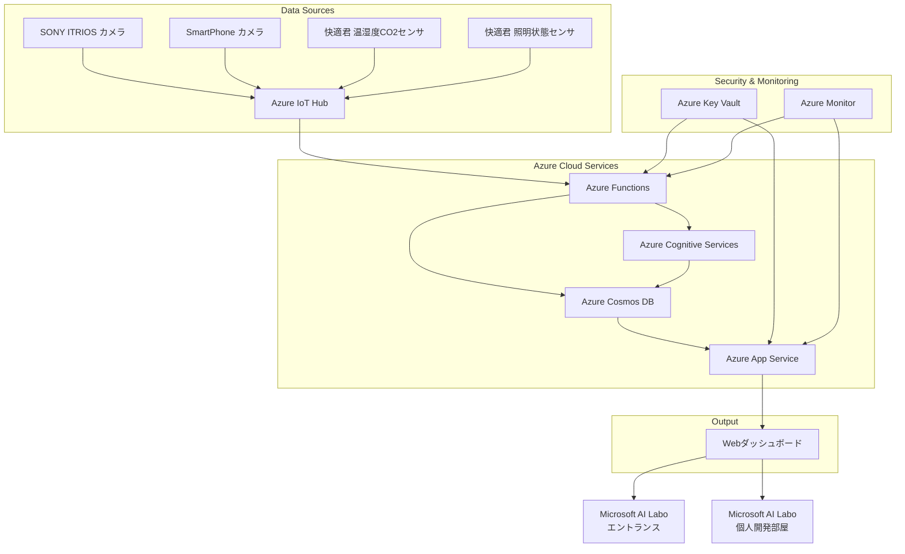
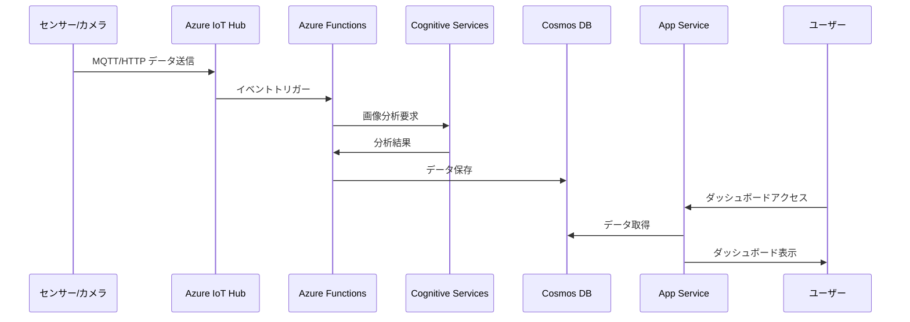

# Microsoft AI Labo スマート空間最適化プロジェクト
## Azure アーキテクチャ設計書

**プロジェクト名:** Microsoft AI Labo スマート空間最適化プロジェクト  
**作成日:** 2025年8月6日  
**バージョン:** 1.0  
**対象:** 2025年10月プレスリリース対応

---

## 1. システム概要

本システムは、Microsoft AI Laboのエントランスおよび個人開発部屋において、空間の利用状況と環境データを収集・分析し、最適化を図るAzureベースのシステムです。

### 1.1. 主要機能
- **エントランスモニター機能**: 来場者の人数、年齢・性別分布、行動パターンの可視化
- **個人開発部屋環境モニター機能**: 温湿度・CO2濃度・利用状況の可視化
- **Webダッシュボード**: リアルタイムデータ表示とトレンド分析

### 1.2. データフロー
```
センサー/カメラ → データ収集 → データ処理 → データストレージ → Webダッシュボード
```

---

## 2. Azure サービス構成

### 2.1. 推奨Azureサービス一覧

| 機能領域 | 推奨サービス | 代替サービス | 用途 |
|---------|-------------|-------------|------|
| **データ収集** | Azure IoT Hub | Azure Event Hubs | センサーデータの収集・管理 |
| **データ処理** | Azure Functions | Azure Logic Apps | リアルタイムデータ処理 |
| **データストレージ** | Azure Cosmos DB | Azure SQL Database | 時系列データ・分析データの保存 |
| **Webアプリケーション** | Azure App Service | Azure Container Instances | ダッシュボードWebアプリ |
| **AI/ML処理** | Azure Cognitive Services | Azure Machine Learning | 人物認識・行動分析 |
| **監視・ログ** | Azure Monitor | Application Insights | システム監視・ログ管理 |
| **セキュリティ** | Azure Key Vault | - | シークレット管理 |
| **ネットワーク** | Azure Virtual Network | - | ネットワーク分離 |

### 2.2. 詳細サービス選定理由

#### 2.2.1. データ収集層
**推奨: Azure IoT Hub**
- **理由**: MQTTプロトコル対応、デバイス管理機能、スケーラビリティ
- **機能**: 
  - 快適君センサーからのMQTT(S)通信
  - デバイス認証・管理
  - メッセージルーティング
- **料金**: 基本料金 + メッセージ数課金

#### 2.2.2. データ処理層
**推奨: Azure Functions**
- **理由**: サーバーレス、イベント駆動、コスト効率
- **機能**:
  - IoT Hubからのデータ受信処理
  - データ正規化・変換
  - リアルタイム分析処理
- **料金**: 実行時間 + メモリ使用量課金

#### 2.2.3. データストレージ層
**推奨: Azure Cosmos DB**
- **理由**: 時系列データ対応、高可用性、スケーラビリティ
- **機能**:
  - センサーデータの時系列保存
  - 分析データの保存
  - 高速クエリ処理
- **料金**: ストレージ容量 + 要求ユニット課金

#### 2.2.4. Webアプリケーション層
**推奨: Azure App Service**
- **理由**: 管理の簡素化、自動スケーリング、HTTPS対応
- **機能**:
  - ダッシュボードWebアプリのホスティング
  - 自動スケーリング
  - SSL証明書管理
- **料金**: プラン別固定料金

#### 2.2.5. AI/ML処理層
**推奨: Azure Cognitive Services**
- **理由**: 事前構築済みAI機能、簡単統合
- **機能**:
  - Computer Vision API（人物認識）
  - Face API（年齢・性別推定）
  - Custom Vision（行動パターン分析）
- **料金**: API呼び出し回数課金

---

## 3. アーキテクチャ図

### 3.1. システム全体アーキテクチャ



### 3.2. データフロー詳細



---

## 4. サービス詳細設計

### 4.1. Azure IoT Hub 設定

#### 4.1.1. 基本設定
- **SKU**: S1 (Standard)
- **メッセージ数**: 400,000/日
- **デバイス数**: 最大100台

#### 4.1.2. メッセージルーティング
```json
{
  "routes": [
    {
      "name": "sensorDataRoute",
      "source": "DeviceMessages",
      "condition": "deviceId IN ['comfort-kun-001', 'comfort-kun-002']",
      "endpointNames": ["sensorDataFunction"]
    },
    {
      "name": "cameraDataRoute", 
      "source": "DeviceMessages",
      "condition": "deviceId IN ['itrios-camera-001', 'smartphone-camera-001']",
      "endpointNames": ["cameraDataFunction"]
    }
  ]
}
```

### 4.2. Azure Functions 設計

#### 4.2.1. 関数構成
| 関数名 | トリガー | 用途 | 実行頻度 |
|--------|----------|------|----------|
| `ProcessSensorData` | IoT Hub | センサーデータ処理 | リアルタイム |
| `ProcessCameraData` | IoT Hub | カメラデータ処理 | リアルタイム |
| `AnalyzePersonData` | HTTP | 人物分析 | オンデマンド |
| `GenerateAnalytics` | Timer | 分析データ生成 | 5分間隔 |

#### 4.2.2. 処理フロー
```csharp
// ProcessSensorData 関数例
public static async Task ProcessSensorData(
    [IoTHubTrigger("messages/events", Connection = "IoTHubConnection")] EventData message,
    [CosmosDB("smartspace", "sensorData", ConnectionStringSetting = "CosmosDBConnection")] IAsyncCollector<SensorData> sensorDataCollector)
{
    var sensorData = JsonSerializer.Deserialize<SensorData>(message.Body.Array);
    sensorData.Timestamp = DateTime.UtcNow;
    sensorData.DeviceId = message.SystemProperties["iothub-connection-device-id"].ToString();
    
    await sensorDataCollector.AddAsync(sensorData);
}
```

### 4.3. Azure Cosmos DB 設計

#### 4.3.1. データモデル
```json
// センサーデータ
{
  "id": "sensor-2025-08-06-001",
  "deviceId": "comfort-kun-001",
  "timestamp": "2025-08-06T10:30:00Z",
  "temperature": 22.5,
  "humidity": 55.0,
  "co2": 450,
  "lightStatus": "on",
  "type": "sensor"
}

// 人物データ
{
  "id": "person-2025-08-06-001",
  "deviceId": "itrios-camera-001",
  "timestamp": "2025-08-06T10:30:00Z",
  "age": 25,
  "gender": "male",
  "action": "walking",
  "type": "person"
}
```

#### 4.3.2. パーティション戦略
- **センサーデータ**: `/deviceId` でパーティション分割
- **人物データ**: `/timestamp` でパーティション分割

### 4.4. Azure App Service 設計

#### 4.4.1. アプリケーション構成
- **ランタイム**: Node.js 18 LTS
- **プラン**: Basic B1
- **インスタンス数**: 1-3（自動スケーリング）

#### 4.4.2. 環境変数
```bash
COSMOSDB_CONNECTION_STRING=your_connection_string
IOTHUB_CONNECTION_STRING=your_connection_string
COGNITIVE_SERVICES_KEY=your_api_key
```

---

## 5. セキュリティ設計

### 5.1. 認証・認可
- **Azure Active Directory**: ユーザー認証
- **Managed Identity**: サービス間認証
- **Azure Key Vault**: シークレット管理

### 5.2. ネットワークセキュリティ
- **Azure Virtual Network**: ネットワーク分離
- **Private Endpoints**: データベースアクセス制限
- **Network Security Groups**: ファイアウォール設定

### 5.3. データ保護
- **暗号化**: 保存時・転送時の暗号化
- **プライバシー**: 個人情報の匿名化処理
- **コンプライアンス**: GDPR準拠

---

## 6. 監視・運用設計

### 6.1. Azure Monitor 設定
- **メトリクス監視**: CPU、メモリ、ディスク使用率
- **ログ分析**: アプリケーションログ、エラーログ
- **アラート**: 異常検知・通知

### 6.2. 運用プロセス
- **デプロイ**: Azure DevOps Pipeline
- **バックアップ**: 自動バックアップ設定
- **障害対応**: 自動復旧・手動復旧手順

---

## 7. コスト見積もり

### 7.1. 月間コスト見積もり（日本リージョン）

| サービス | プラン | 月間コスト（概算） |
|----------|--------|-------------------|
| Azure IoT Hub | S1 | ¥15,000 |
| Azure Functions | Consumption | ¥5,000 |
| Azure Cosmos DB | 400 RU/s | ¥20,000 |
| Azure App Service | Basic B1 | ¥8,000 |
| Azure Cognitive Services | Pay-as-you-go | ¥10,000 |
| Azure Monitor | Basic | ¥2,000 |
| **合計** | - | **¥60,000** |

### 7.2. コスト最適化
- **リザーブドインスタンス**: 長期利用時の割引
- **自動スケーリング**: 需要に応じたリソース調整
- **データライフサイクル**: 古いデータの自動削除

---

## 8. 実装ロードマップ

### 8.1. Phase 1: 基盤構築（2週間）
- [ ] Azure リソース作成
- [ ] IoT Hub 設定
- [ ] Cosmos DB 設定
- [ ] 基本的なFunctions作成

### 8.2. Phase 2: データ収集（2週間）
- [ ] センサー接続テスト
- [ ] データフロー確認
- [ ] エラーハンドリング実装

### 8.3. Phase 3: Webアプリケーション（2週間）
- [ ] ダッシュボード開発
- [ ] データ可視化実装
- [ ] UI/UX調整

### 8.4. Phase 4: 統合・テスト（1週間）
- [ ] システム統合テスト
- [ ] パフォーマンステスト
- [ ] セキュリティテスト

### 8.5. Phase 5: 本番展開（1週間）
- [ ] 本番環境構築
- [ ] 監視設定
- [ ] ドキュメント整備

---

## 9. リスク・課題

### 9.1. 技術的リスク
- **IoTデバイス接続**: ネットワーク不安定性
- **AI処理精度**: 人物認識の精度不足
- **スケーラビリティ**: 大量データ処理時の性能

### 9.2. 対策
- **冗長化**: 複数デバイス・バックアップ
- **精度向上**: モデル改善・データ品質向上
- **性能最適化**: キャッシュ・インデックス最適化

---

## 10. まとめ

本設計書では、Microsoft AI Labo スマート空間最適化プロジェクトのAzure実装について詳細に検討しました。

### 10.1. 主要ポイント
- **サーバーレスアーキテクチャ**: コスト効率とスケーラビリティ
- **マネージドサービス**: 運用負荷の軽減
- **セキュリティファースト**: 包括的なセキュリティ対策
- **監視・運用**: 自動化された運用プロセス

### 10.2. 次のステップ
1. Azure サブスクリプション設定
2. リソースグループ作成
3. 基盤サービス構築開始
4. 開発環境準備

この設計に基づいて実装を進めることで、2025年10月のプレスリリースに向けた堅牢でスケーラブルなシステムを構築できます。
