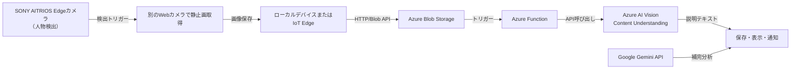

# Microsoft AI Labo スマート空間最適化プロジェクト
## AI分析システム 機能仕様書

**プロジェクト名:** Microsoft AI Labo スマート空間最適化プロジェクト  
**システム名:** AI分析システム  
**作成日:** 2025年8月6日  
**バージョン:** 1.0  
**対象:** 2025年10月プレスリリース対応

---

## 1. システム概要

### 1.1. 目的
Microsoft AI Laboのエントランスにおいて、複数のAI技術を組み合わせて来場者の行動パターンを分析し、空間の利用状況を可視化するシステムです。

### 1.2. システム構成
- **SONY AITRIOS Edgeカメラ**: 人物検出トリガー
- **Webカメラ**: 高解像度画像取得
- **Azure AI Vision**: 画像内容理解
- **Google Gemini API**: 高度な分析・説明生成
- **統合制御システム**: データフロー管理

---

## 2. 機能要件

### 2.1. 人物検出機能

#### 2.1.1. AITRIOS Edgeカメラ機能
- **検出対象**: 人物の存在
- **検出精度**: 高精度（SDK/IMX500対応）
- **通信方式**: MQTT連携
- **応答時間**: リアルタイム（数ミリ秒）

#### 2.1.2. 検出トリガー機能
- **トリガー条件**: 人物検出時
- **連続検知制御**: 抑制・バッファリング機能
- **誤検知対策**: フィルタリング機能

### 2.2. 画像取得機能

#### 2.2.1. Webカメラ機能
- **撮影方式**: 静止画取得
- **解像度**: 高解像度対応
- **フォーマット**: JPEG/PNG
- **制御方式**: リモート制御

#### 2.2.2. 画像保存機能
- **保存先**: ローカルデバイスまたはIoT Edge
- **ファイル管理**: 自動整理・削除
- **容量管理**: ストレージ監視

### 2.3. AI分析機能

#### 2.3.1. Azure AI Vision機能
- **分析内容**: 画像内容理解
- **出力形式**: JSON形式
- **応答時間**: 数秒以内
- **対応フォーマット**: JPEG/PNG

#### 2.3.2. Gemini API機能
- **分析内容**: 高度な説明生成
- **通信方式**: WebSocket（ステートフル）
- **対応プラットフォーム**: Android/Flutter/Unity
- **セッション制限**: Firebaseプロジェクトごとに最大10セッション

### 2.4. データ統合機能

#### 2.4.1. データフロー制御
- **トリガー制御**: AITRIOS検出 → カメラ撮影 → Azureアップロード
- **エラーハンドリング**: 通信エラー・タイムアウト対応
- **データ整合性**: 時系列データの管理

#### 2.4.2. 結果統合
- **データマージ**: 複数AI結果の統合
- **信頼度評価**: 複数結果の重み付け
- **最終出力**: 統合された分析結果

---

## 3. 技術仕様

### 3.1. システム構成図



### 3.2. データフロー詳細

#### 3.2.1. 検出・撮影フロー
1. **AITRIOS人物検出**
   - リアルタイム人物検出
   - MQTTメッセージ送信
   - トリガー信号生成

2. **Webカメラ撮影**
   - 高解像度静止画取得
   - ローカル保存
   - メタデータ付与

3. **Azureアップロード**
   - Blob Storageへの転送
   - HTTP/Blob API使用
   - 認証管理（SAS）

#### 3.2.2. AI分析フロー
1. **Azure AI Vision分析**
   - 画像内容理解
   - オブジェクト検出
   - キャプション生成

2. **Gemini API分析**
   - 高度な説明生成
   - 行動パターン分析
   - コンテキスト理解

3. **結果統合**
   - 複数結果のマージ
   - 信頼度評価
   - 最終出力生成

### 3.3. データ形式

#### 3.3.1. Azure AI Vision出力例
```json
{
  "captionResult": {
    "text": "Two workers assembling machinery in a factory setting",
    "confidence": 0.91
  },
  "objects": [
    {"name": "person", "confidence": 0.98},
    {"name": "machinery", "confidence": 0.85}
  ],
  "timestamp": "2025-08-06T10:30:00Z",
  "deviceId": "aitrios-camera-001"
}
```

#### 3.3.2. Gemini API出力例
```json
{
  "analysis": {
    "action": "assembling",
    "context": "factory_work",
    "people_count": 2,
    "activity_level": "moderate",
    "confidence": 0.87
  },
  "description": "作業員2名が機械の組立作業を行っている",
  "timestamp": "2025-08-06T10:30:00Z"
}
```

---

## 4. 実現性評価

### 4.1. 技術的実現性

| 要素 | 実現性 | 解説 |
|------|--------|------|
| AITRIOS人物検出 | ◎ | SDK/IMX500で高速検知、MQTT連携可 |
| 別カメラ撮影 | ◎ | Raspberry PiやIPカメラ対応 |
| Azure Blob保存 | ◎ | Python/Node.jsで簡単に実装可能 |
| Vision API | ◯ | JPEG/PNG対応、数秒以内に応答 |
| Gemini API | ◯ | WebSocket対応、高度な分析可能 |
| 統合制御 | ◎ | Logic AppsやFunctionsで柔軟に構成可能 |

### 4.2. メリットと工夫

| 観点 | 内容 |
|------|------|
| **精度** | AITRIOSはトリガー用途、Azureで精緻な理解 |
| **通信負荷** | 必要時のみ静止画送信で軽量 |
| **実装自由度** | MQTT/Webhookで柔軟な連携 |
| **データ拡張** | GPTと組み合わせてレポート化可能 |
| **UX設計** | クラウド処理による遅延を「リアルタイム風」体験で演出 |

---

## 5. 制約事項

### 5.1. 技術的制約

#### 5.1.1. レイテンシ
- **処理時間**: 数秒〜数十秒
- **リアルタイム性**: リアルタイム用途には不向き
- **対策**: UX設計による体感速度の向上

#### 5.1.2. セキュリティ
- **認証管理**: SASなど認証管理が必要
- **データ保護**: 個人情報の適切な処理
- **通信暗号化**: HTTPS/TLS必須

#### 5.1.3. フォーマット制限
- **対応形式**: JPEG/PNGのみ
- **動画対応**: 不可
- **ファイルサイズ**: 制限あり

### 5.2. 運用制約

#### 5.2.1. リソース制限
- **Gemini API**: Firebaseプロジェクトごとに最大10セッション
- **Azure Vision**: API呼び出し回数制限
- **ストレージ**: 容量制限

#### 5.2.2. ネットワーク要件
- **インターネット接続**: 必須
- **APIキー**: 必要
- **安定性**: 高安定性要求

---

## 6. UX設計方針

### 6.1. リアルタイム体験の演出

#### 6.1.1. スナップショット方式
- **逐次送信**: スナップショットを逐次送信
- **キャプション生成**: 動的にキャプション生成
- **動画重ね表示**: 動画に重ねて表示

#### 6.1.2. フレーム単位処理
- **推論単位**: フレーム単位の推論
- **一時的動き**: 一時的な動きが反映されない可能性
- **対策**: 適切なフレーム間隔設定

### 6.2. ユーザー体験の最適化

#### 6.2.1. 視覚的フィードバック
- **進行状況表示**: 処理状況の可視化
- **結果表示**: 分かりやすい結果表示
- **エラー表示**: 適切なエラーメッセージ

#### 6.2.2. 操作性向上
- **直感的操作**: 直感的なユーザーインターフェース
- **レスポンシブ対応**: 各種デバイス対応
- **アクセシビリティ**: アクセシビリティ配慮

---

## 7. 実装計画

### 7.1. Phase 1: 基盤構築（2週間）
- [ ] AITRIOSカメラ設定
- [ ] Webカメラ接続
- [ ] Azure Blob Storage設定
- [ ] 基本的なデータフロー構築

### 7.2. Phase 2: AI統合（2週間）
- [ ] Azure AI Vision統合
- [ ] Gemini API統合
- [ ] 結果統合ロジック実装
- [ ] エラーハンドリング実装

### 7.3. Phase 3: UX実装（1週間）
- [ ] リアルタイム体験の実装
- [ ] 結果表示UI実装
- [ ] ユーザビリティテスト
- [ ] パフォーマンス最適化

### 7.4. Phase 4: 統合・テスト（1週間）
- [ ] システム統合テスト
- [ ] 負荷テスト
- [ ] セキュリティテスト
- [ ] 最終調整

---

## 8. リスク管理

### 8.1. 技術的リスク

#### 8.1.1. レイテンシ問題
- **リスク**: 処理遅延によるユーザー体験の悪化
- **対策**: UX設計による体感速度向上、キャッシュ機能

#### 8.1.2. API制限
- **リスク**: API呼び出し回数制限による機能停止
- **対策**: 適切な制限管理、フォールバック機能

#### 8.1.3. ネットワーク不安定性
- **リスク**: 通信エラーによる機能停止
- **対策**: リトライ機能、オフライン対応

### 8.2. 運用リスク

#### 8.2.1. コスト管理
- **リスク**: API使用量増加によるコスト上昇
- **対策**: 使用量監視、最適化

#### 8.2.2. プライバシー保護
- **リスク**: 個人情報の不適切な処理
- **対策**: 匿名化処理、アクセス制御

---

## 9. 成功指標

### 9.1. 技術指標
- **検出精度**: 95%以上
- **処理時間**: 10秒以内
- **システム稼働率**: 99%以上
- **エラー率**: 1%以下

### 9.2. ユーザー体験指標
- **ユーザー満足度**: 4.0/5.0以上
- **操作成功率**: 95%以上
- **レスポンス時間**: 3秒以内
- **アクセシビリティ**: WCAG 2.1準拠

---

## 10. まとめ

本機能仕様書では、Microsoft AI Labo スマート空間最適化プロジェクトのAI分析システムについて詳細に定義しました。

### 10.1. 主要ポイント
- **複数AI技術の統合**: AITRIOS + Azure Vision + Gemini
- **リアルタイム体験の演出**: UX設計による体感速度向上
- **スケーラブルな構成**: クラウドベースの柔軟な拡張性
- **セキュリティ重視**: 包括的なセキュリティ対策

### 10.2. 次のステップ
1. 技術検証の実施
2. プロトタイプ開発
3. ユーザビリティテスト
4. 本格実装開始

この仕様に基づいて実装を進めることで、2025年10月のプレスリリースに向けた高度なAI分析システムを構築できます。
