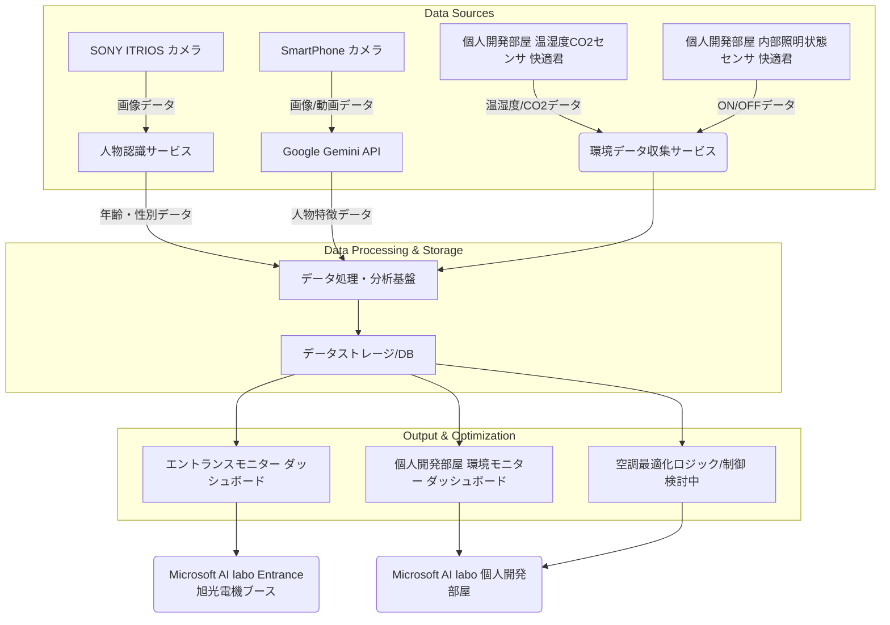

# Microsoft AI Labo スマート空間最適化プロジェクト 開発仕様書

**プロジェクト名:** Microsoft AI Labo スマート空間最適化プロジェクト  
**開発主体:** 旭光電機株式会社  
**作成日:** 2025年7月16日 (スプリント開発概要に基づく)  
**バージョン:** 1.0  
**参考資料:** Microsoft AI Labo.pdf(スプリント開発概要について記載)

## 1. 概要

本プロジェクトは、Microsoft AI Laboのエントランスおよび個人開発部屋において、空間の利用状況と環境データを収集・分析し、最適化を図ることを目的とします。エントランスでは来場者の行動パターンをデータ化し、個人開発部屋では温湿度・CO2レベルの監視による空調の最適化、および利用率の可視化を行います。

## 2. プロジェクトスコープ

本スプリント開発では、以下の内容を実装します。

### 2.1. エントランスモニター機能

#### 来場者のデータ化
- エントランスに来る来場者の人数、年齢傾向、性別などのデータを収集・可視化します。

#### 行動パターンのデータ化
- 動画解析を用いて、来場者の行動パターンをデータ化します。

#### カメラ設置
- 共用部は配線工事が難しいため、ラボ側にカメラを設置し、窓を通してエントランスをモニターします。
- **SONY ITRIOS** と **SmartPhone** の2台のカメラを設置します。

#### 利用技術

**SONY ITRIOS（人物認識）:**
- 人物認識を実行し、撮影している画像から以下の属性値を取得します：(TBD)
  - 年齢
  - 性別

**SmartPhone（人物特徴分析）:**
- Google Geminiを利用して、人物の特徴を属性値として取得します：(TBD)
  - 人物の行動パターン
  - その他の特徴量データ

### 2.2. 開発個人部屋の環境モニター機能

#### 空調の最適化
- 温湿度センサーを用いて温湿度を監視し、空調の最適化に利用します。
- CO2センサーを用いてCO2濃度を監視します。

#### 利用率の可視化
- 内部照明のON/OFF状態を検知することで、部屋の滞在状況（利用率）を可視化します。

#### 利用技術
- **温湿度CO2センサ:** 快適君（旭光電機）

## 3. システム構成（アーキテクチャ）

以下の図は、本プロジェクトにおけるシステムの概念的なアーキテクチャを示します。

### システム構成の説明

- **データソース:** 
  - **SONY ITRIOS**: 画像から年齢・性別の属性値を抽出
  - **SmartPhone + Google Gemini**: 人物の特徴や行動パターンを分析
  - **快適君**: 個人開発部屋からは温湿度、CO2、照明ON/OFFデータが収集されます。
- **データ処理・分析基盤:** 収集された生データは、人物認識サービス（SONY ITRIOS）、Google Gemini API（SmartPhone）、環境データ収集サービスを通じて処理され、分析基盤に集約されます。
- **データストレージ:** 処理されたデータはデータベースに格納されます。
- **出力・最適化:** 格納されたデータは、各ダッシュボードで可視化される他、個人開発部屋の空調最適化ロジックへ入力されます。

## 4. 検討が必要な内容

現状の資料から、以下の項目について詳細な検討と決定が必要です。

### データ連携方法とプロトコル
- 各種センサー、カメラからデータ処理・分析基盤への具体的なデータ連携方法（例: 有線/無線、MQTT/HTTP、クラウド連携サービスなど）
- 特に「SmartPhone」が動画認識にどのように活用され、データがどこに送信されるのか

### データ処理・分析基盤の具体的な技術スタック
- AWS、Azure、GCPなどのクラウドサービスか、オンプレミスか
- データ処理パイプラインの構築方法（例: ストリーミング処理、バッチ処理）

### データストレージの詳細
- データベースの種類（例: NoSQL, リレーショナルDB）とデータモデル
- データ保存期間、データ容量の見積もり

### 空調最適化ロジックの具体化
- 温湿度、CO2データから、どのように空調を「最適化」するのか
- 自動制御を行うのか、または管理者にレコメンドを提示するのか
- 制御対象となる空調システムとの連携方法

### ダッシュボードの要件
- 表示する情報の種類、グラフ形式、更新頻度など
- 利用するBIツールや可視化フレームワーク

### プライバシーへの配慮
- エントランスにおける来場者の「人数や年齢傾向」「行動パターン」のデータ化における、プライバシー保護の具体的なガイドラインと実装方法
- データの匿名化、保存期間、アクセス制限など

### セキュリティ要件
- データ通信の暗号化、データアクセス認証、システム全体の脆弱性対策など

### カメラの詳細
- エントランスカメラの具体的な機種、解像度、画角、夜間・低照度時の性能、ネットワーク要件など
- 「窓を通してエントランスをモニター」する際の、光の反射、歪み、画質への影響と対策

### Microsoft AI labo 受付（希望される場合）
この項目がスプリント開発全体構成図に含まれていますが、具体的な「AIラボで開発＆ラボへの実装内容」に記載がありません。この項目が本プロジェクトのスコープに含まれる場合、その具体的な内容と連携方法を定義する必要があります。

## 5. 質問（抜けている項目について）

上記の「検討が必要な内容」と関連しますが、開発を具体的に進めるにあたり、以下の情報が不足しているためご質問させていただきます。

1. **データの可視化とレポート機能の詳細**  
   収集したデータをどのようにユーザーに提示する予定ですか？ (例: Webダッシュボード、モバイルアプリ、定期レポートなど)

2. **アラート/通知機能の有無**  
   温湿度やCO2濃度が閾値を超えた場合、または利用率の異常があった場合に、関係者にアラートや通知を発する機能は必要ですか？

3. **既存システムとの連携**  
   Microsoft AI Labo内の既存の空調システムやセキュリティシステムなど、連携が必要なシステムはありますか？

4. **プロジェクトのフェーズとタイムライン**  
   スプリント開発と記載がありますが、全体的な開発ロードマップや主要なマイルストーンはどのように設定されていますか？

5. **Microsoft AI Labo 受付に関する詳細**  
   「Microsoft AI labo 受付（希望される場合）」は、今回のプロジェクトの範囲に含まれますか？含まれる場合、どのような機能が期待されていますか？
