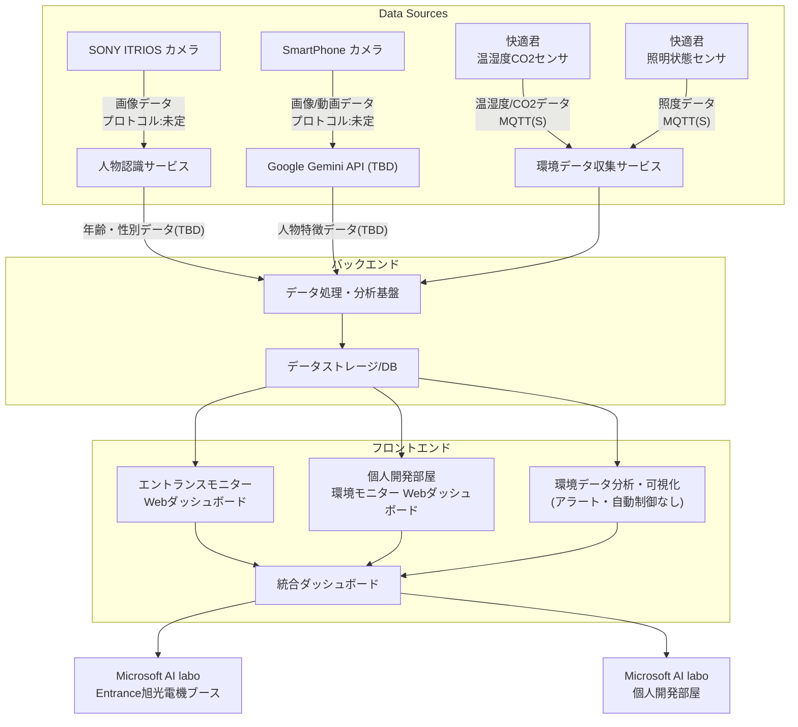

# Microsoft AI Labo スマート空間最適化プロジェクト 開発仕様書

**プロジェクト名:** Microsoft AI Labo スマート空間最適化プロジェクト 
**略称:** MAISS (マイス　：Microsoft AI Labo Smart Space Sprint)
**開発主体:** 旭光電機株式会社  
**作成日:** 2025年8月19日 (スプリント開発概要に基づく)  
**バージョン:** 1.0  
**参考資料:** Microsoft AI Labo.pdf(スプリント開発概要について記載)

## 1. 概要

本プロジェクトは、Microsoft AI Laboのエントランスおよび個人開発部屋において、空間の利用状況と環境データを収集・分析し、最適化を図ることを目的とします。エントランスでは来場者の行動パターンをデータ化し、個人開発部屋では温湿度・CO2レベルの監視による空調の最適化、および利用率の可視化を行います。

## 1.1. プロジェクトタイムライン　(TBD)

**重要なマイルストーン:**
- **プレスリリース予定:** 2025年10月
- **目標:** プレスリリースまでに動作するシステムの完成

**開発スケジュール概要:**
- **現在（2025年8月）:** 仕様策定・設計フェーズ
- **2025年9月:** 開発・実装・テストフェーズ
- **2025年10月上旬:** システム統合・最終調整
- **2025年10月中旬:** プレスリリース対応

**プレスリリース時点での必須機能:**
- エントランスモニター機能（基本的な人数・属性データの可視化）
- 個人開発部屋の環境モニター機能（温湿度・CO2による空調最適化の可視化）
- 基本的なダッシュボード表示

## 2. プロジェクトスコープ

本スプリント開発では、以下の内容を実装します。

**2025年10月プレスリリースに向けた開発優先度:**
- **優先度1（必須）:** 基本的なデータ収集・可視化機能
- **優先度2（推奨）:** 高度な分析・最適化機能
- **優先度3（将来対応）:** 自動制御・アラート機能

### 2.1. エントランスモニター機能　(TBD)

#### 来場者のデータ化 **【優先度1】**
- エントランスに来る来場者の人数、年齢傾向、性別などのデータを収集・可視化します。

#### 行動パターンのデータ化 **【優先度2】**
- 動画解析を用いて、来場者の行動パターンをデータ化します。

#### カメラ設置
- 共用部は配線工事が難しいため、ラボ側にカメラを設置し、窓を通してエントランスをモニターします。
- **SONY ITRIOS** と **SmartPhone** の2台のカメラを設置します。

#### 利用技術

**SONY ITRIOS（人物認識）:**
- 人物認識を実行し、撮影している画像から以下の属性値を取得します：(TBD)
  - 年齢
  - 性別

**SmartPhone（人物特徴分析）:**
- Google Geminiを利用して、人物の特徴を属性値として取得します：(TBD)
  - 人物の行動パターン
  - その他の特徴量データ

### 2.2. 開発個人部屋の環境モニター機能

#### 空調の最適化 **【優先度1】**
- 温湿度センサーを用いて温湿度を監視し、空調の最適化に利用します。
- CO2センサーを用いてCO2濃度を監視します。
- 既存の空調システムとの連携は行わず、データの可視化のみを実装
- 自動制御は実装せず、管理者向けの情報表示に留める

#### 利用率の可視化 **【優先度2】**
- 内部照明のON/OFF状態を検知することで、部屋の滞在状況（利用率）を可視化します。

#### 利用技術
- **温湿度CO2センサ:** 快適君（旭光電機）

## 3. システム構成（アーキテクチャ）

以下の図は、本プロジェクトにおけるシステムの概念的なアーキテクチャを示します。

### システム構成の説明

- **データソース:** 
  - **SONY ITRIOS**: 画像から年齢・性別の属性値を抽出
  - **SmartPhone + Google Gemini**: 人物の特徴や行動パターンを分析
  - **快適君**: 個人開発部屋からは温湿度、CO2、照明ON/OFFデータが収集されます。
- **データ処理・分析基盤:** 収集された生データは、人物認識サービス（SONY ITRIOS）、Google Gemini API（SmartPhone）、環境データ収集サービスを通じて処理され、分析基盤に集約されます。
- **データストレージ:** 処理されたデータはデータベースに格納されます。
- **出力・可視化:** 格納されたデータは、Webダッシュボードで可視化されます。アラート・通知機能、既存システムとの連携は実装しません。

## 3.1. センサークラウド間インターフェース仕様

システム内の各コンポーネント間のデータ通信プロトコルと接続方式を以下に定義します。

### 環境センサー系
- **快適君（温湿度CO2センサ） → 環境データ収集サービス**
  - プロトコル: MQTT(S) - Message Queuing Telemetry Transport over TLS/SSL
  - 通信方式: セキュアな暗号化通信
  - データ形式: JSON形式での温湿度・CO2・照明状態データ

### エントランスカメラ系
- **SONY ITRIOS カメラ → 人物認識サービス**
  - プロトコル: **未定**（検討中）
  - 候補: HTTP/HTTPS、専用API、ストリーミングプロトコル等
  - データ形式: 画像データ（年齢・性別認識用）

- **SmartPhone カメラ → Google Gemini API**
  - プロトコル: **未定**（検討中）
  - 候補: HTTPS REST API、WebSocket、モバイルSDK等
  - データ形式: 画像/動画データ（人物特徴分析用）

### 検討事項
- ITRIOSカメラの通信プロトコル選定
- SmartPhone実装方式（ネイティブアプリ vs Webアプリ）の決定
- リアルタイム性要件に応じた通信方式の最適化

## 3.2. Webダッシュボード仕様

### 基本仕様
- **表示方式:** Webダッシュボードによる可視化（モバイルアプリ、定期レポートは対象外）
- **アクセス方法:** ブラウザからアクセス可能なURL
- **機能範囲:** データ表示・可視化のみ（アラート・通知機能なし）
- **技術基盤:** Microsoft Azure

### 対象ダッシュボード
- **エントランスモニター用Webダッシュボード**
  - 来場者数、年齢・性別分布の表示
  - 時間別・日別のトレンド表示
- **個人開発部屋環境モニター用Webダッシュボード**
  - 温湿度・CO2データのリアルタイム表示
  - 環境データの履歴・トレンド表示

### 検討事項
- 表示する情報の種類、グラフ形式、更新頻度
- 利用するWebフレームワークや可視化ライブラリ
- レスポンシブ対応の必要性

## 4. プロジェクト制約事項

### 機能制約
- **アラート・通知機能なし:** メール通知、ブザー等のアラート機能は実装しません
- **既存システム連携なし:** Microsoft AI Labo内の既存システムとの連携は行いません
- **自動制御なし:** 空調等の自動制御機能は実装しません

### 技術制約
- **可視化方式:** Webダッシュボードのみ（モバイルアプリ、定期レポートなし）
- **表示のみ:** データの表示・可視化機能に特化

### スコープ制約
- **Microsoft AI Labo 受付:** プロジェクトスコープ外（完成後にダッシュボードURL連絡のみ）
- **プレスリリース期限:** 2025年10月までに基本機能を完成
- **開発優先順位:** 優先度1の機能（基本的なデータ収集・可視化）を最優先で実装
